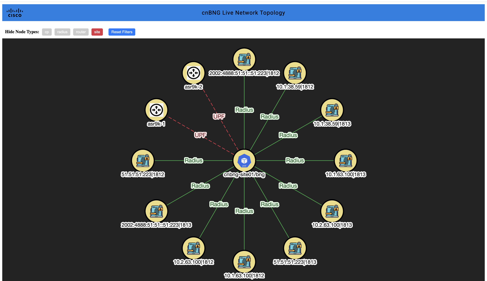

# 🌐 Topology Discovery & Viewer

An interactive network topology visualization system that discovers, displays, and auto-updates the network graph using a combination of:

- 🐍 Python-based discovery agent
- 🧩 Flask backend
- ⚛️ React + Cytoscape.js frontend
- 🐳 Fully containerized with Docker Compose

---

## 📸 UI Features

The **Viewer** is a modern web UI with the following capabilities:

### 🧠 Intelligent Layout (Star Topology)
- Auto-positions central nodes (like `cp`) in the middle.
- Dynamically re-renders using `concentric` layout with `cytoscape`.

### 🖱️ Interactive Graph
- **Hover tooltips** powered by Tippy.js.
- Icons for different device types (router, pod, radius, site).
- Smooth transitions with animated node appearance/disappearance.
- Hover over any node to see its label, type, and all available metadata (such as direction, interface, VRF, etc.).
- Hover over any edge to see protocol, label, and all available metadata.
- Edge color and style reflect their state (active, inactive, default).

### 🕵️‍♀️ Real-Time Filtering
- Toggle buttons to hide specific node types (`router`, `pod`, `site`, etc.).
- Dynamic filtering also affects connected edges.

### 🔄 Live Polling
- UI polls `/static/topology.json` every **10 seconds**.
- Updates topology graph in real-time, **without requiring reload**.

---

## 📁 Project Structure

```
topology-discovery/
├── discovery_agent/         # Python discovery service
│   ├── main.py
│   ├── builder.py
│   ├── parser.py
│   └── requirements.txt
├── server/                  # Flask backend API
│   └── app.py
├── static/                  # Shared mount for topology.json
│   └── topology.json
├── viewer/
│   ├── Dockerfile           # Multi-stage React+nginx setup
|   ├── nginx.conf       # SPA routing support
│   └── frontend/
│       ├── src/             # React + Cytoscape source
│       ├── dist/            # Built UI (generated via `npm run build`)
│       ├── vite.config.js   # Dev proxy config
│       ├── index.html
│       ├── package.json
├── docker-compose.yml
└── README.md
```

---

## 🐳 Running with Docker Compose

### 🧱 Step 1: Build all services

```bash
docker-compose build --no-cache
```

### ▶️ Step 2: Start the stack

```bash
docker-compose up --detach
```

> This will start 3 containers:
> - `discovery_agent`: Generates topology data into `static/topology.json`
> - `server`: Flask backend on port **5002**
> - `viewer`: React UI via nginx on port **80**

---

## 🌍 Access Points

| Component     | URL                            | Description                          |
|---------------|---------------------------------|--------------------------------------|
| Viewer UI     | [http://localhost](http://localhost)       | Interactive graph UI                |
| Flask Backend | [http://localhost:5002](http://localhost:5002) | Serves frontend & JSON              |
| Topology JSON | [http://localhost:5002/static/topology.json](http://localhost:5002/static/topology.json) | Auto-generated file from agent |

---

## 🔁 Live Update Flow

1. `discovery_agent` connects to routers every **`$POLL_INTERVAL`** seconds.
2. Executes `show peers`, `show bgp-neighbors`, parses the result.
3. Updates `static/topology.json`.
4. The frontend fetches updates via polling and rerenders automatically.

### ⚙️ Custom Poll Interval

Set polling frequency by updating:

```env
POLL_INTERVAL=30  # in seconds
```

Or override during container start using:

```bash
docker run -e POLL_INTERVAL=30 ...
```

---

## 🧪 Development (Optional)

### React Frontend (Dev Mode)

```bash
cd viewer/frontend
npm install
npm run dev
```

> Access: [http://localhost:5173](http://localhost:5173)

Make sure `/static` requests are proxied correctly via `vite.config.js`:

```js
server: {
  proxy: {
    '/static': 'http://localhost:5002'
  }
}
```

---

## 🧼 Clean Rebuild (optional)

```bash
docker-compose down -v
docker-compose build --no-cache
docker-compose up
```

---

## Output

A sample output visualization might look like this:


A sample output visualization with filter might look like this:



---

## 🔍 Customization Ideas

- [ ] Show node health/capacity metrics.
- [ ] Integrate with Prometheus/Grafana.
- [ ] Support on-click node details (popup/side drawer).
- [ ] Toggle between layouts: concentric / dagre / grid.
- [ ] Collapsible clusters for logical grouping.

---

## 💬 Contact

If you have ideas, issues, or want to contribute, feel free to:
- Open a GitHub issue
- Drop a pull request

---

🛠️ Built with ❤️ using React, Flask, Docker & Netmiko.